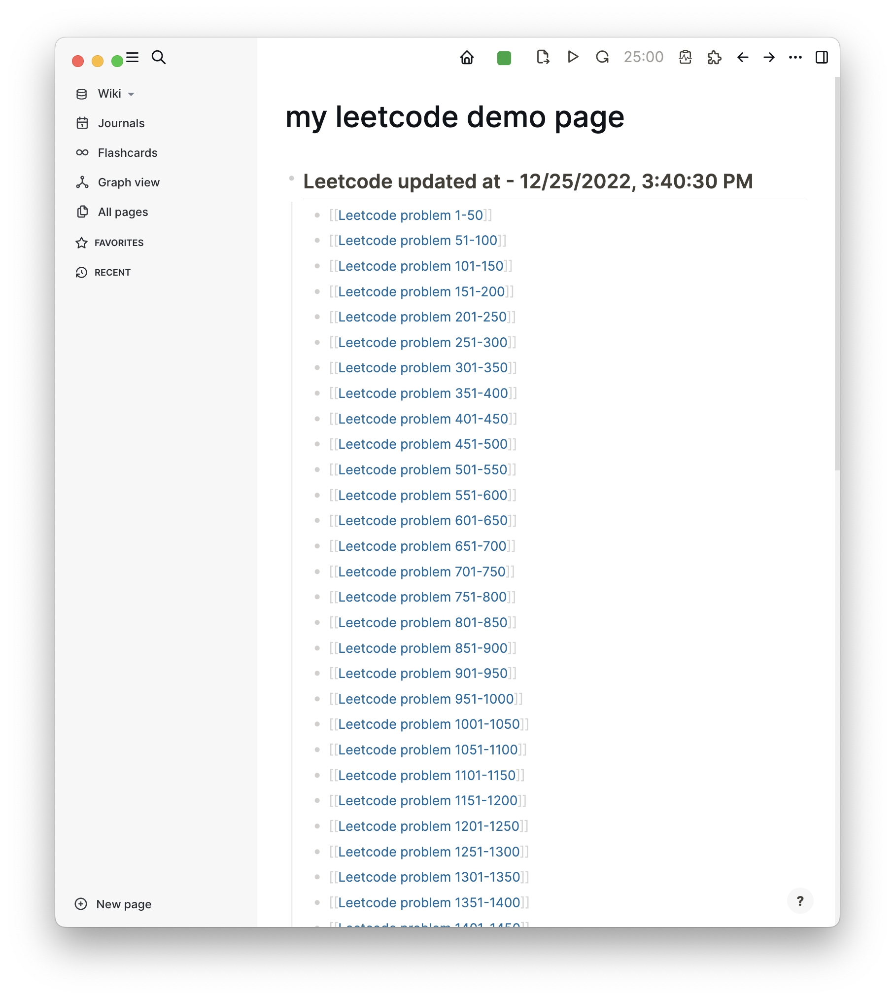
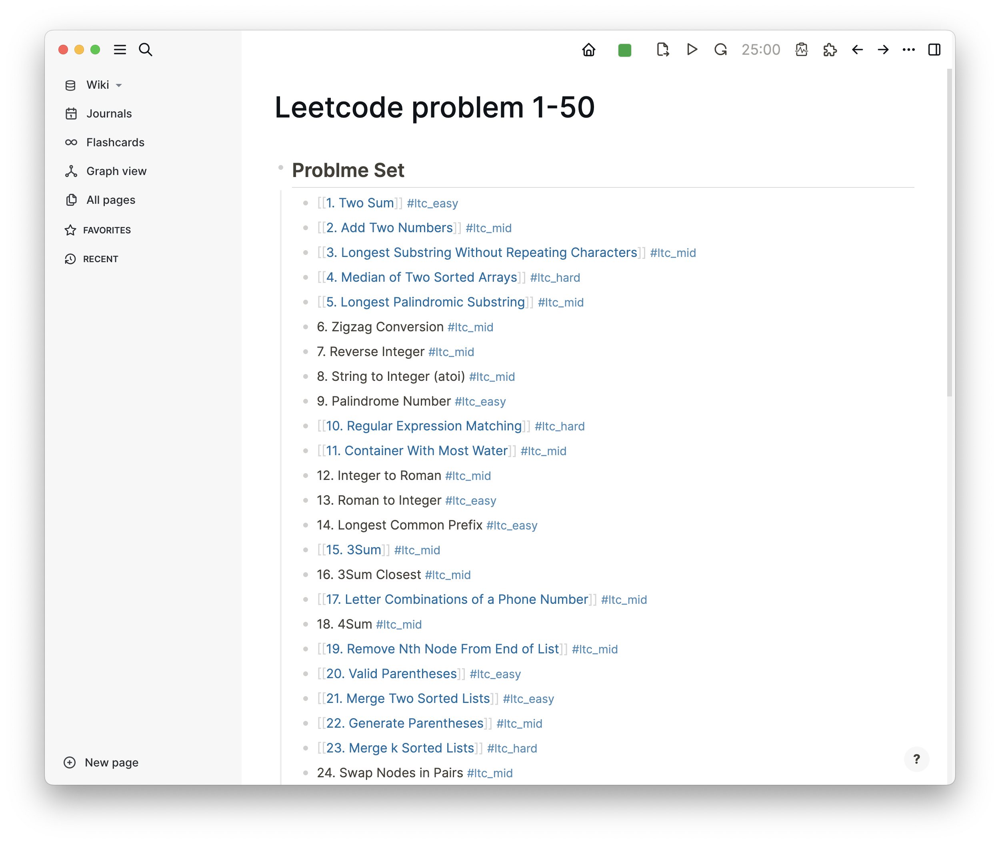
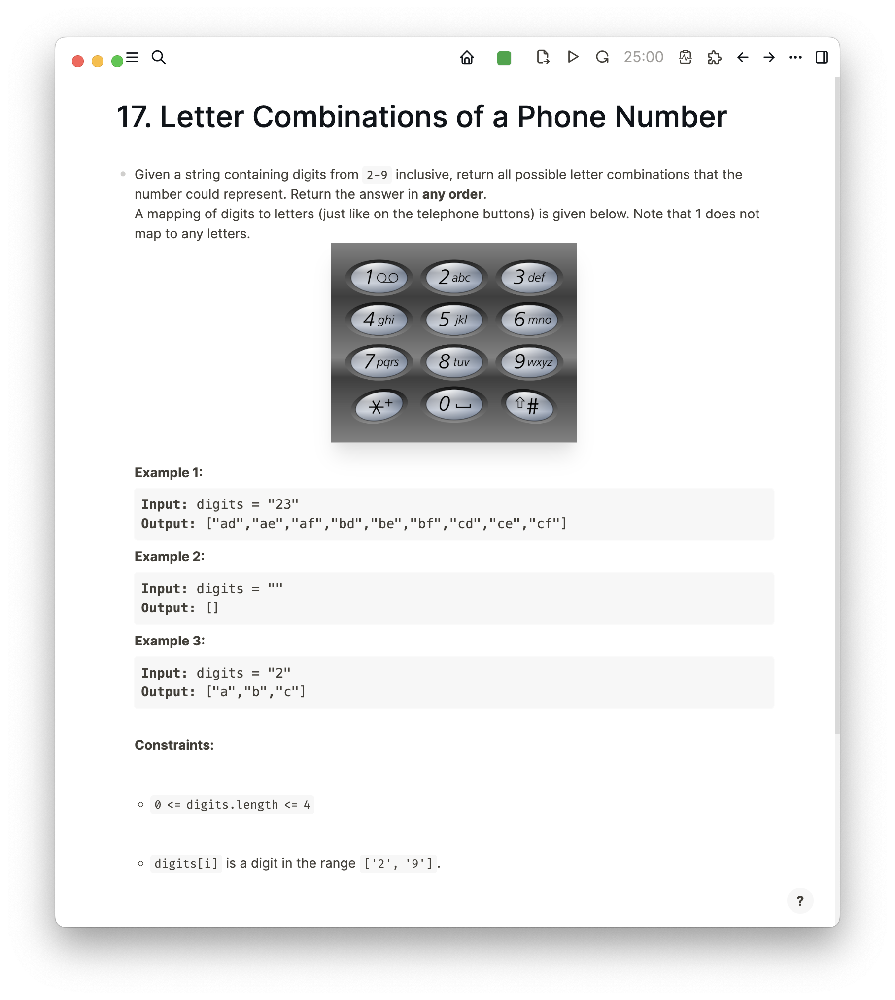

# Logseq Plugin Leetcode

A plugin that can fetch **leetcode** problem in your logseq.

It provides two commands: `ltc all problems` and `ltc fetch problem`.

## Guide

### Before using it

1、install this plugin `logseq-plugin-leetcode`;
2、Input your leetcode account info in `logseq > Settings > Plugins > logseq plugin leetcode`;

### ltc all problems

This command will fetch all leetcode problems, and builds tree page.
This command will only create `leetcode hot 100` problems detail page.If you want fetch speical problem detail in your page or block, using `ltc fetch problem` cmd.

### ltc fetch problem

1、Using problem slug as id to fetch. Leetcode URL like `https://leetcode.cn/problems/3sum/`, `3sum` is the slug for this problem.
2、Input `3sum/ltc fetch problem`, and type enter to fetch detail.
